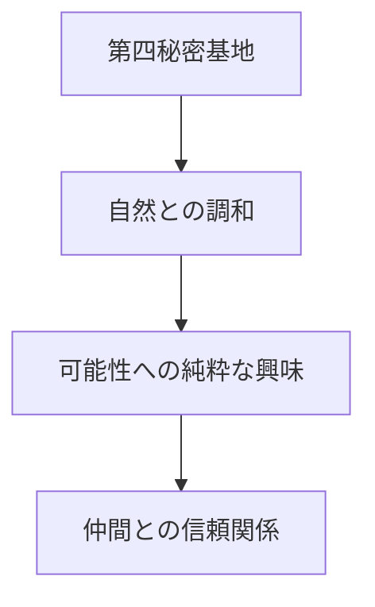
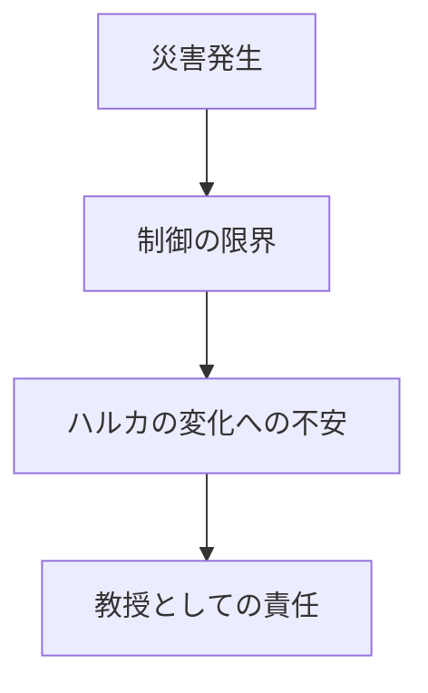

## マコの内面の変遷

### 1. 理想の時代（前編）


- 手入れの行き届いた植物たち
- 自然な形での可能性の観測
- 仲間との和やかな研究生活

### 2. 亀裂の時代（後編前半）


- 自然の驚異への直面
- 人知の限界の認識
- 指導者としての無力感

### 3. 決断の時代（後編後半）
```
内なる葛藤：
「可能性を管理すべき」
↕
「自然な営みを守りたい」
```

結果として：
- 心相結晶の保管という新しい取り組み
  - 人々の人生を大切に保存
  - 形あるものとして残す
- ガーデニングの継続
  - 生命への敬意
  - 自然との対話
- 特異能力者への厳格な姿勢
  - ハルカの二の舞を防ぐため
  - 組織としての責任

### 象徴的な場面案

#### 前編：理想の表現
```
第四秘密基地の窓辺
花を愛でながらハルカと会話するマコ
「可能性って、この花みたいなものかもしれないわね」
「大切に育てれば、きっと美しく咲くはず」
```

#### 後編：葛藤の表現
```
崩壊した研究室
倒れた植物の鉢を抱えるマコ
「ハルカ...私たちは何を間違えたのかしら」
「このまま...朽ちさせるわけにはいかない」
```

#### エピローグ：決意の表現
```
管理局の窓辺
新しい鉢植えの前で
「制御すべきもの、守るべきもの」
「その境界線を、私たちは見失っていたのね」
```

---
この描写により：
1. 完全な合理主義者ではない人間性
2. 特異能力者への警戒の理由
3. 組織のトップとしての責任感
が自然に表現できる。

特に、植物との関わりを通じて彼女の内面を表現することで、
無機質な管理者としてではなく、より人間味のある人物として描くことを可能とする。