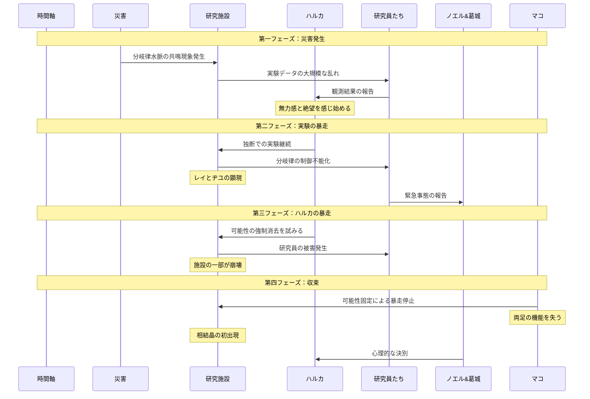

## 第一フェーズ：災害発生
- 国内の分岐律水脈が予期せぬ共鳴を起こす
- 研究施設の実験データに異常な乱れが発生
- ハルカは「記録を取るだけ」という研究の限界を痛感
- この時点では、まだ冷静な判断が可能な状態

## 第二フェーズ：実験の暴走
- ハルカが独断で実験を継続（「何かできるはず」という思い）
- 分岐律制御システムが完全に機能を停止
- 実験室の分岐律水脈が予期せぬ反応を示す
- この混乱の中で、レイとヂユが実体化
- 研究員たちの動揺と混乱が始まる

## 第三フェーズ：ハルカの暴走
- 無力感から、可能性そのものを否定し始める
- 初めて「可能性の消去」能力を使用
- 研究員たちに被害が出始める
- 施設の一部が崩壊（可能性の消失による物理的な影響）
- ノエルと葛城が事態の収拾を試みるが失敗

## 第四フェーズ：収束と代償
- マコが固定化能力で事態を収束
- 代償として両足の機能を失う
- 初めての相結晶が発見される（犠牲者の遺品から）
- ノエル、葛城、マコがハルカとの決別を決意
- 管理局の方針が大きく転換される契機に

## 事件概要図

## 事件の影響
1. 組織への影響
   - 可能性の管理体制が厳格化
   - 技術依存から人的判断重視へ
   - 商社としての体制確立

2. 人物への影響
   - マコ：可能性の固定化に傾倒
   - ノエル：調和を重視する姿勢へ
   - 葛城：表の顔として組織を守る道を選択
   - ハルカ：可能性の消去に執着

3. 技術的影響
   - 相結晶の発見
   - レイとヂユの存在
   - 分岐律水脈システムの改良