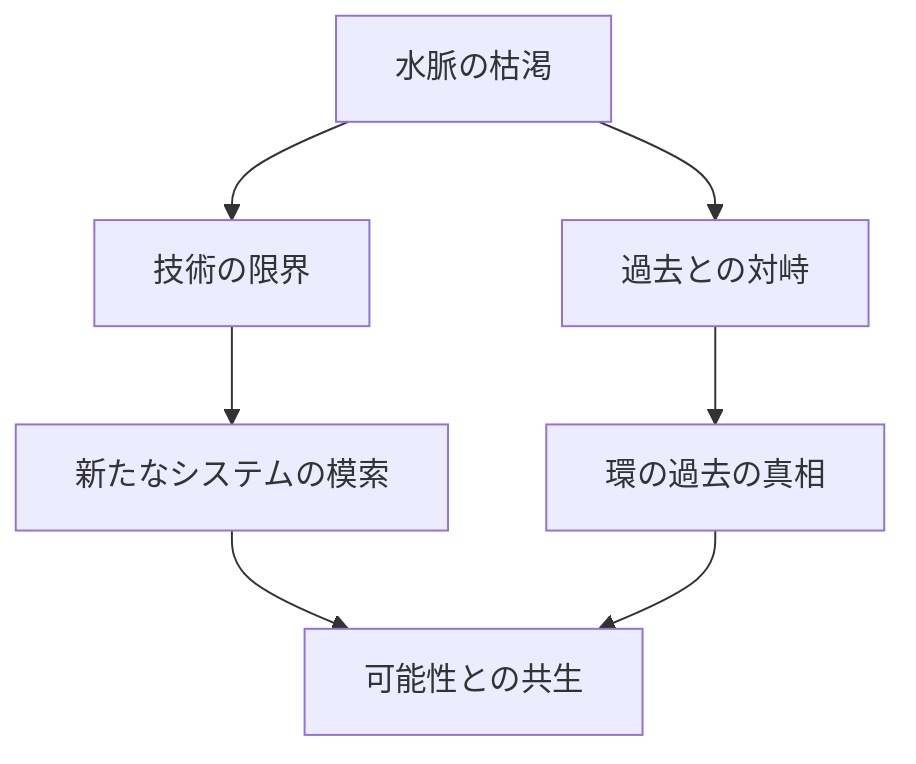

# パラレル 続編企画案
## コンセプト：「共鳴の慣性」

### 基本設定
- 時期：前作から10年後
- 舞台：可能性管理局および双和総合商事
- 主題：「制度化された可能性管理の限界と革新」

### 主要キャラクター
#### 新体制
- 局長：佐藤サナ（35歳）
  - かつての新人から、組織のトップへ
  - 「可能性を創る」力を完全に制御できるように
  - リーダーとしての重圧と決断を担う立場に
- 特別顧問：レイ
  - サナの右腕として組織の要に
  - より大人びた態度と深い洞察力を獲得
- 監査部長：ヂユ
  - 規律と革新のバランスを取る重要人物に
  - かつての硬さは残しつつ、より柔軟な判断力も

#### 商事側
- 会長：葛城蓮
  - 経営の一線からは退くも、重要な場面で関与
  - 10年前の教訓を活かした助言者として
- 社長：加藤勇作
  - 「普通」の視点を持ちながら非常事態に対応
  - 管理局との新たな関係を模索

#### 新キャラクター
- 新人管理官：茶色い長髪の少女
  - 素直で有能だが、謎めいた過去を持つ
  - サナの「10年前」との何らかの繋がり
- 反管理局活動家たち
  - 様々な立場と動機を持つ市民
  - 単純な敵対者ではなく、それぞれの正義を持つ

### 核となる事件
1. 分岐律水脈の枯渇
   - 管理局の根幹システムの機能不全
   - 可能性の管理が困難になっていく展開
   - 技術への依存の限界が露呈

2. 結晶の不安定化
   - 保管された可能性の制御が困難に
   - 過去の選択が現在に及ぼす影響
   - 封印された可能性の再来

3. 秘密の露呈
   - 管理局の存在が一般に知れ渡る
   - 社会の反応と対立の表面化
   - 可能性管理の是非を問う議論

### テーマ性
1. 制度化された管理の光と影
   - システム化された可能性管理の限界
   - 人間の選択と技術の関係

2. 責任の継承
   - 前世代（ノエル、マコ）の意志
   - 新世代による新たな答えの模索

3. 可能性との向き合い方
   - 管理すべきか、共存すべきか
   - 社会システムとしての可能性管理の在り方

### 主要な展開案
1. 序盤：日常の崩壊
   - 水脈の異常と結晶の不安定化
   - 新人の加入と組織の日常
   - 潜在的な危機の予兆

2. 中盤：危機の表面化
   - 可能性の暴走と社会への影響
   - 反管理局運動の激化
   - 新人の過去と事件の関連性

3. 終盤：新たな選択
   - サナによる重大な決断
   - 管理局の在り方を問い直す
   - 可能性との新たな関係性の構築

### エピローグ案
- 新たなシステムの構築
- 社会との関係の再定義
- 次世代への継承

### 未解決の謎
1. ノエルとマコの不在
   - 意図的に言及を避ける展開
   - 読者の想像に委ねる要素として

2. 新人の秘密
   - 10年前との繋がり
   - サナの過去との関連性

### 象徴的モチーフ
1. 枯渇する水脈
   - 技術への過度な依存の象徴
   - 自然な可能性の流れの重要性

2. 露呈する秘密
   - 閉じた組織の限界
   - 社会との関係性の必要性

---
1. サナは局長として、部下に「分岐律水脈系統」と正式名称で言うべきか「堀の水」と親しみやすい呼び方にするか、かつてのヂユとレイの立場を理解しながら判断する立場に。

2. レイとヂユも10年の経験を経て:
- レイ：より責任ある立場になったものの、相変わらず「堀の水」と呼ぶ
- ヂユ：規律重視は変わらないが、時にはレイの表現も認めるような柔軟さも

3. 分岐律水脈の枯渇という事態に直面して、これまで当たり前に使ってきた技術基盤の重要性を再認識する展開。

このように、単なる呼称の違いだった部分が、10年後には組織文化や世代間の価値観の違いを表現する要素として使えそうですね。

新人の茶色い長髪の少女は、恐らく分岐律水脈について何か重要な秘密を知っているのかもしれません。その謎が物語の重要なカギになりそうです。

---
1. レイの立場の活用
- 特別顧問として重要な立場でありながら、相変わらずのお調子者っぽさは健在
- 例えば重要な会議中に「堀の水」と言ってヂユに今でも突っ込まれる
- ただし状況を見て切り替えられる大人になっている

2. 新人キャラクターの可能性
- 表面上は大人しそうに見えて、実は天然ボケな一面も
- サナやレイと絡むことで、思わぬドジを踏んだり
- その失敗が意外な発見につながったり

3. 加藤勇作社長の活用
- 「普通」の視点を持ちながら非常事態に対応する中で、思わずコミカルな反応
- 例：重要会議中に「えーと、分岐律って何でしたっけ...」と本音が漏れる

4. 日常シーンの挿入
- 危機的状況の中でも、管理局の休憩室での他愛もない会話
- サナが局長になっても、窓際で堀を眺める習慣は変わらないなど
- かつての新人時代を思い出して照れるサナ

5. ヂユの変化を活かす
- 10年経って少しだけ柔軟になった部分を、コミカルに表現
- たまに思わぬジョークを言って周りを驚かせる
- でもすぐに「...業務に戻ります」と元に戻る

こうした要素を織り交ぜることで、重いテーマを扱いながらも、時折クスッと笑える瞬間や心温まる場面を作れそうですね。

また、新人の少女を通じて「初めて見る管理局」の新鮮な視点を描くことで、10年前のサナのような等身大の感覚も取り戻せるかもしれません。

---

1. 新人の過去について：
可能性として以下のような設定はどうでしょうか：
- 10年前のヒスイの失踪事件の際、可能性の暴走に巻き込まれた一般市民の子供だった
- その時の記憶は曖昧だが、自分の中に何か特別な力が芽生えた（例：失われた可能性を「見る」能力）
- サナたちは気づいていないが、彼女の存在自体が「消えたはずの可能性」が形を変えて現れた証
この設定により、前作との繋がりと新しい展開の両方を描けます。

2. ノエルとマコの不在について：
これは意図的に謎のままにするのが良いかもしれません。
- 施設のどこかに二人の肖像画だけが飾られている
- たまに二人の名前が会話に出るが、詳細は語られない
- サナが時々二人の執務室だった場所を訪れる程度の描写
読者の想像力を刺激する「語られない謎」として残すことで、物語に深みを持たせられます。

3. ハルカの扱いについて：
これは非常に難しい判断ですね。以下の観点から検討してみましょう：

登場させる場合のメリット：
- 前作との強い連続性が生まれる
- 「可能性を消す力」と「水脈の枯渇」の関連を描ける
- サナとの再対決で新たな展開が作れる

登場させない場合のメリット：
- 新しい物語として fresh な展開が作れる
- 新たな脅威や問題に焦点を当てられる
- ハルカの存在が大きすぎて新キャラクターが埋もれる危険を避けられる

個人的な提案としては：
「ハルカは直接は登場させず、その影響や痕跡だけを残す」
というアプローチはどうでしょうか？

例えば：
- 分岐律水脈の枯渇は、10年前のハルカの行動の遅延した影響である
- 新人の少女の能力は、ハルカの「消去」とサナの「創造」が偶然生み出した予期せぬ結果
- つまりハルカは「不在の脅威」として物語に影を落とす
