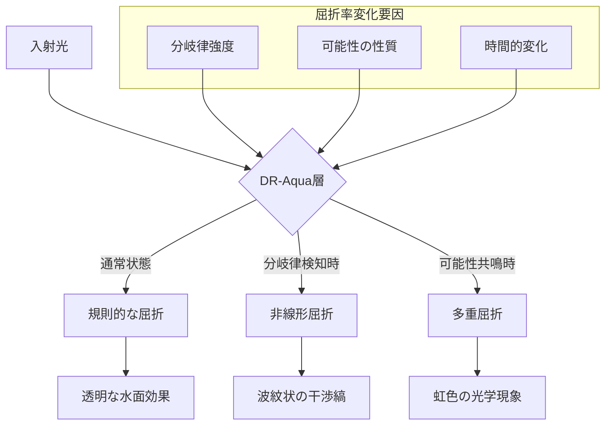

```mermaid
flowchart TD
    A[入射光] --> B{DR-Aqua層}
    B -->|通常状態| C[規則的な屈折]
    B -->|分岐律検知時| D[非線形屈折]
    B -->|可能性共鳴時| E[多重屈折]

    C --> F[透明な水面効果]
    D --> G[波紋状の干渉縞]
    E --> H[虹色の光学現象]

    subgraph 屈折率変化要因
    I[分岐律強度]
    J[可能性の性質]
    K[時間的変化]
    end

    I --> B
    J --> B
    K --> B

```