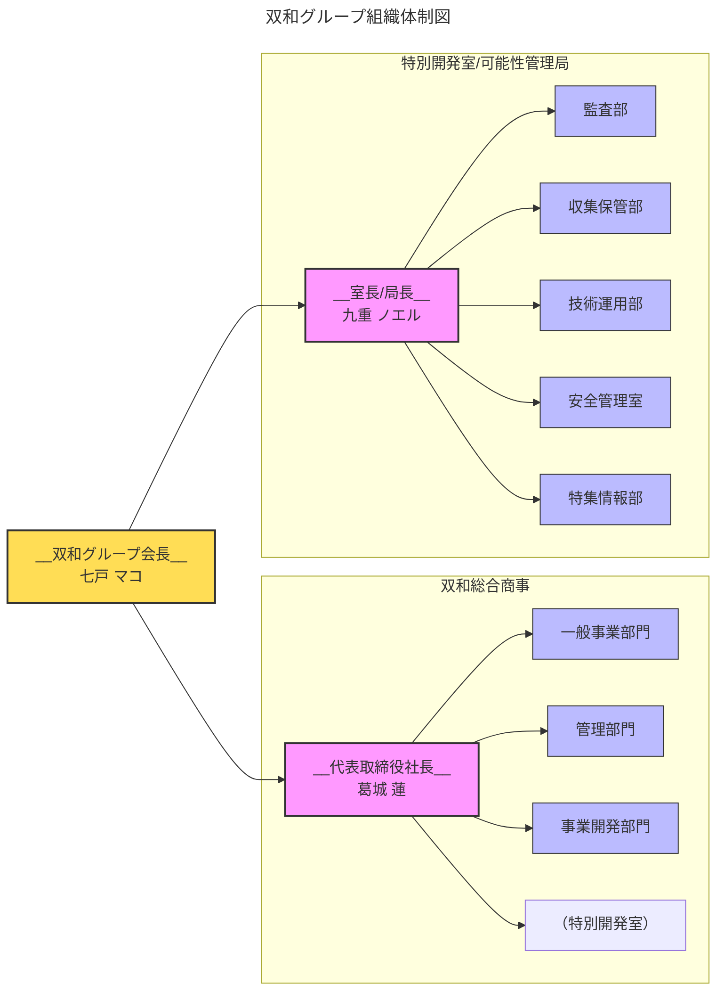

```mermaid
---
title: 双和グループ組織体制図
---

graph LR
    DIR[__双和グループ会長__<br>七戸 マコ]

    %% 表組織
    subgraph 双和総合商事
        CEO[__代表取締役社長__<br>葛城 蓮]
        GEN[一般事業部門]
        ADM[管理部門]
        DEV[事業開発部門]
        DIR_A[（特別開発室）]
    end

    %% 裏組織（表の名称：特別開発室）
    subgraph 特別開発室/可能性管理局
        DIR_B[__室長/局長__<br>九重 ノエル]

        %% 現業部門
        AUD[監査部]
        COL[収集保管部]
        TEC[技術運用部]
        SEC[安全管理室]
        SPC[特集情報部]
    end

    %% トップの関係性
    CEO --> GEN
    CEO --> ADM
    CEO --> DEV
    CEO --> DIR_A

    DIR --> CEO
    DIR --> DIR_B
    DIR_B --> AUD
    DIR_B --> COL
    DIR_B --> TEC
    DIR_B --> SEC
    DIR_B --> SPC

    %% スタイル
    classDef veryexecutive fill:#fD5,stroke:#333,stroke-width:2px
    classDef executive fill:#f9f,stroke:#333,stroke-width:2px
    classDef department fill:#bbf,stroke:#333,stroke-width:1px
    classDef section fill:#ddf,stroke:#333,stroke-width:1px
    classDef person fill:#dff,stroke:#333,stroke-width:1px

    class DIR veryexecutive
    class CEO,DIR_B executive
    class GEN,ADM,DEV,AUD,COL,TEC,SEC,SPC department
    class TR,DM,SP,PD,GA,HR,AC,LG,RD,COMP,COMP_B,COMP_C,COL_A,COL_B,COL_C,TEC_A,TEC_B,TEC_C,SEC_A,SEC_B,SEC_C,IA,RE,CM section
    class PS_A,PS_B,PS_C,PS_D,PS_E person

```