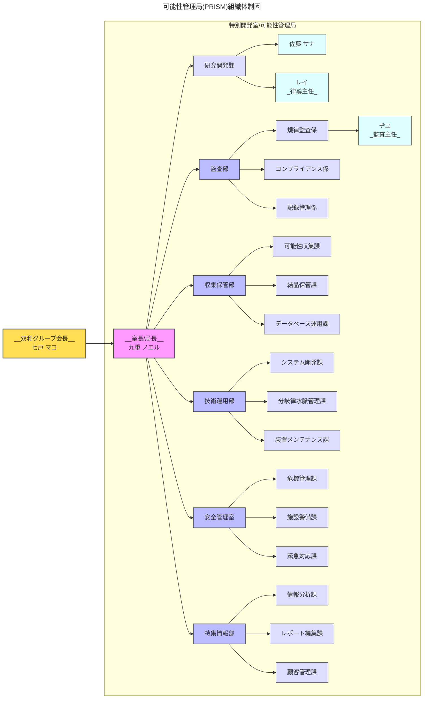

```mermaid
---
title: 可能性管理局(PRISM)組織体制図
---

graph LR
    DIR[__双和グループ会長__<br>七戸 マコ]
    %% 裏組織（表の名称：特別開発室）
    subgraph 特別開発室/可能性管理局
        DIR_B[__室長/局長__<br>九重 ノエル]

        %% 現業部門
        AUD[監査部]
        COL[収集保管部]
        TEC[技術運用部]
        SEC[安全管理室]
        SPC[特集情報部]

        %% 研究開発課の詳細
        RD[研究開発課] --> PS_A[佐藤 サナ]
        RD --> PS_B[レイ<br>_律導主任_]

        %% 監査部の詳細
        AUD --> COMP[規律監査係] --> PS_C[ヂユ<br>_監査主任_]
        AUD --> COMP_B[コンプライアンス係]
        AUD --> COMP_C[記録管理係]

        %% 収集保管部の詳細
        COL --> COL_A[可能性収集課]
        COL --> COL_B[結晶保管課]
        COL --> COL_C[データベース運用課]

        %% 技術運用部の詳細
        TEC --> TEC_A[システム開発課]
        TEC --> TEC_B[分岐律水脈管理課]
        TEC --> TEC_C[装置メンテナンス課]

        %% 安全管理室の詳細
        SEC --> SEC_A[危機管理課]
        SEC --> SEC_B[施設警備課]
        SEC --> SEC_C[緊急対応課]

        %% 特集情報部の詳細
        SPC --> IA[情報分析課]
        SPC --> RE[レポート編集課]
        SPC --> CM[顧客管理課]
    end

    %% トップの関係性
    DIR --> DIR_B
    DIR_B --> RD
    DIR_B --> AUD
    DIR_B --> COL
    DIR_B --> TEC
    DIR_B --> SEC
    DIR_B --> SPC

    %% スタイル
    classDef veryexecutive fill:#fD5,stroke:#333,stroke-width:2px
    classDef executive fill:#f9f,stroke:#333,stroke-width:2px
    classDef department fill:#bbf,stroke:#333,stroke-width:1px
    classDef section fill:#ddf,stroke:#333,stroke-width:1px
    classDef person fill:#dff,stroke:#333,stroke-width:1px

    class DIR veryexecutive
    class CEO,DIR_B executive
    class GEN,ADM,DEV,AUD,COL,TEC,SEC,SPC department
    class TR,DM,SP,PD,GA,HR,AC,LG,RD,COMP,COMP_B,COMP_C,COL_A,COL_B,COL_C,TEC_A,TEC_B,TEC_C,SEC_A,SEC_B,SEC_C,IA,RE,CM section
    class PS_A,PS_B,PS_C,PS_D,PS_E person

```