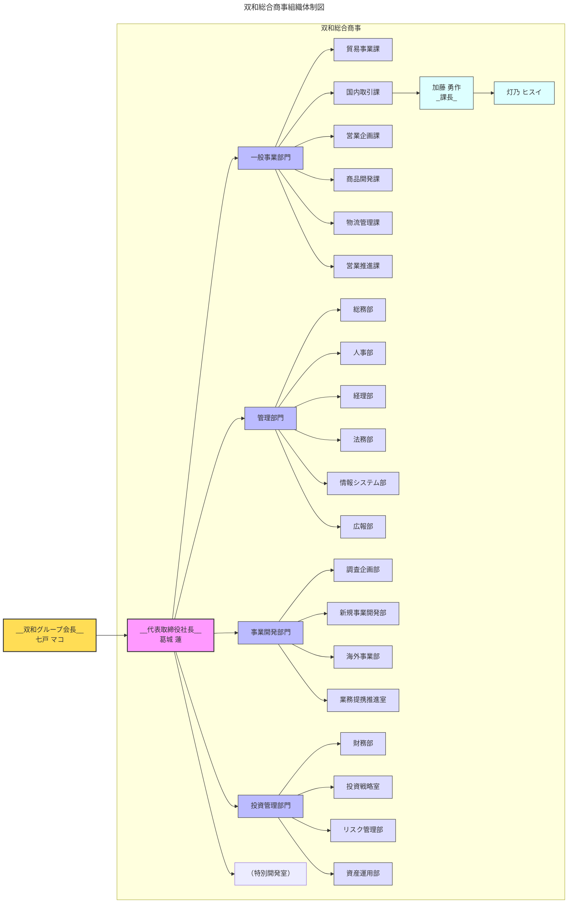

```mermaid
---
title: 双和総合商事組織体制図
---

graph LR
    DIR[__双和グループ会長__<br>七戸 マコ]

    %% 表組織
    subgraph 双和総合商事
        CEO[__代表取締役社長__<br>葛城 蓮]
        GEN[一般事業部門]
        ADM[管理部門]
        DEV[事業開発部門]
        INV[投資管理部門]
        DIR_A[（特別開発室）]

        %% 一般事業部門の下位組織
        GEN --> TR[貿易事業課]
        GEN --> DM[国内取引課] --> PS_D[加藤 勇作<br>_課長_] --> PS_E[灯乃 ヒスイ]
        GEN --> SP[営業企画課]
        GEN --> PD[商品開発課]
        GEN --> LOG[物流管理課]
        GEN --> SAL[営業推進課]

        %% 管理部門の下位組織
        ADM --> GA[総務部]
        ADM --> HR[人事部]
        ADM --> AC[経理部]
        ADM --> LG[法務部]
        ADM --> IT[情報システム部]
        ADM --> PR[広報部]

        %% 事業開発部門の下位組織
        DEV --> RES[調査企画部]
        DEV --> NEW[新規事業開発部]
        DEV --> OVS[海外事業部]
        DEV --> ALL[業務提携推進室]

        %% 投資管理部門の下位組織
        INV --> FIN[財務部]
        INV --> INV_A[投資戦略室]
        INV --> RISK[リスク管理部]
        INV --> ASSET[資産運用部]
    end

    %% トップの関係性
    CEO --> GEN
    CEO --> ADM
    CEO --> DEV
    CEO --> INV
    CEO --> DIR_A

    DIR --> CEO

    %% スタイル
    classDef veryexecutive fill:#fD5,stroke:#333,stroke-width:2px
    classDef executive fill:#f9f,stroke:#333,stroke-width:2px
    classDef department fill:#bbf,stroke:#333,stroke-width:1px
    classDef section fill:#ddf,stroke:#333,stroke-width:1px
    classDef person fill:#dff,stroke:#333,stroke-width:1px

    class DIR veryexecutive
    class CEO executive
    class GEN,ADM,DEV,INV department
    class TR,DM,SP,PD,LOG,SAL,GA,HR,AC,LG,IT,PR,RES,NEW,OVS,ALL,FIN,INV_A,RISK,ASSET section
    class PS_D,PS_E person

```