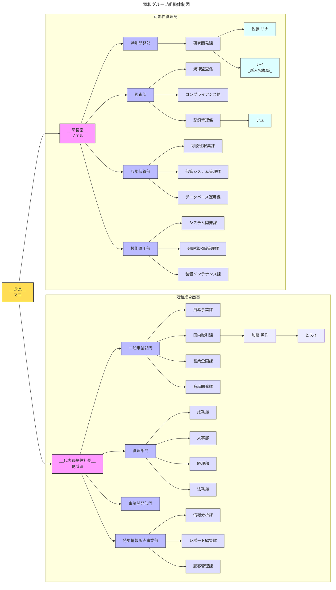

```mermaid
---
title: 双和グループ組織体制図
---

graph LR
    DIR[__会長__<br>マコ]

    %% 表組織
    subgraph 双和総合商事
        CEO[__代表取締役社長__<br>葛城蓮]
        GEN[一般事業部門]
        ADM[管理部門]
        DEV[事業開発部門]
        SPC[特集情報販売事業部]

        %% 一般事業部門の下位組織
        GEN --> TR[貿易事業課]
        GEN --> DM[国内取引課] --> PS_D[加藤 勇作] --> PS_E[ヒスイ]
        GEN --> SP[営業企画課]
        GEN --> PD[商品開発課]

        %% 管理部門の下位組織
        ADM --> GA[総務部]
        ADM --> HR[人事部]
        ADM --> AC[経理部]
        ADM --> LG[法務部]

        %% 特集情報部門
        SPC --> IA[情報分析課]
        SPC --> RE[レポート編集課]
        SPC --> CM[顧客管理課]
    end

    %% 裏組織
    subgraph 可能性管理局
        DIR_B[__局長室__<br>ノエル]

        %% 現業部門
        SPD[特別開発部]
        AUD[監査部]
        COL[収集保管部]
        TEC[技術運用部]

        %% 特別開発部の詳細
        SPD --> RD[研究開発課] --> PS_A[佐藤 サナ]
        RD --> PS_B[レイ<br>_新人指導係_]

        %% 監査課の詳細
        AUD --> COMP[規律監査係]
        AUD --> COMP_B[コンプライアンス係]
        AUD --> COMP_C[記録管理係] --> PS_C[ヂユ]

        COL --> COL_A[可能性収集課]
        COL --> COL_B[保管システム管理課]
        COL --> COL_C[データベース運用課]


        TEC-->TEC_A[システム開発課]
        TEC-->TEC_B[分岐律水脈管理課]
        TEC-->TEC_C[装置メンテナンス課]

    end

    %% トップの関係性
    CEO --> GEN
    CEO --> ADM
    CEO --> DEV
    CEO --> SPC

    DIR --> CEO
    DIR --> DIR_B
    DIR_B --> SPD
    DIR_B --> AUD
    DIR_B --> COL
    DIR_B --> TEC

    %% スタイル
    classDef veryexecutive fill:#fD5,stroke:#333,stroke-width:2px
    classDef executive fill:#f9f,stroke:#333,stroke-width:2px
    classDef department fill:#bbf,stroke:#333,stroke-width:1px
    classDef section fill:#ddf,stroke:#333,stroke-width:1px
    classDef person fill:#dff,stroke:#333,stroke-width:1px

    class DIR veryexecutive
    class CEO,DIR_B executive
    class GEN,ADM,DEV,SPC,SPD,AUD,COL,TEC department
    class TR,DM,SP,PD,GA,HR,AC,LG,IA,RE,CM,RD,COMP,COMP_B,COMP_C,COL_A,COL_B,COL_C,TEC_A,TEC_B,TEC_C section
    class PS_A,PS_B,PS_C, person

```